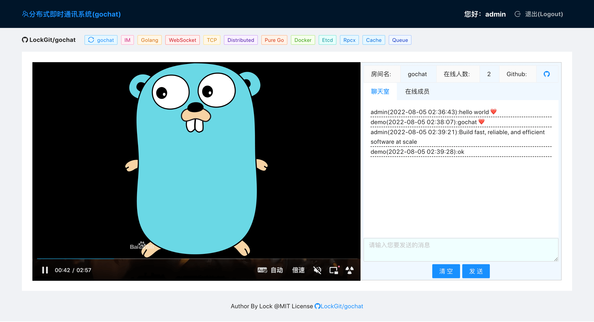

# Getting Started gochat-ui

## Available Scripts

In the project directory, you can run:

###  `yarn start` or `npm start`

Runs the app in the development mode.\
Open [http://localhost:3000](http://localhost:3000) to view it in the browser.

## Description

gochat-ui is the front-end implementation of the open source project gochat [https://github.com/LockGit/gochat](https://github.com/LockGit/gochat) 

